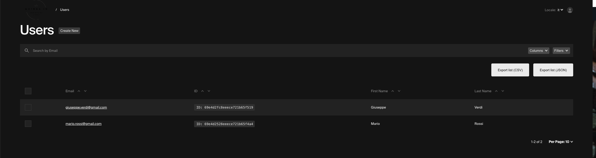
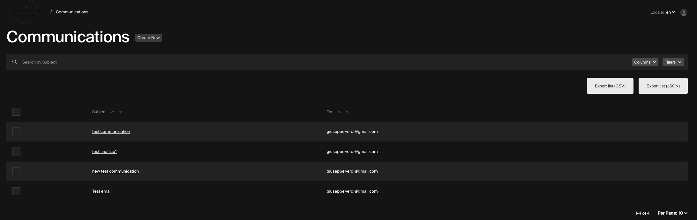
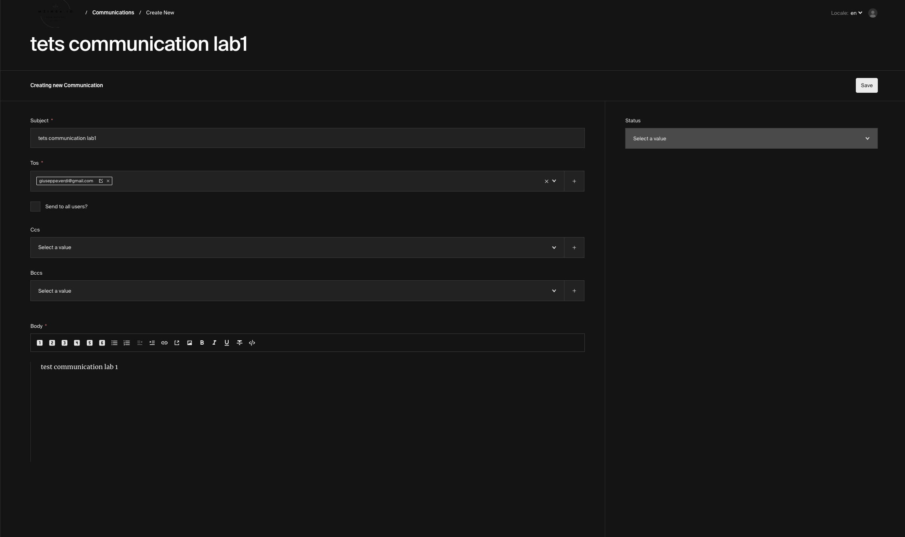
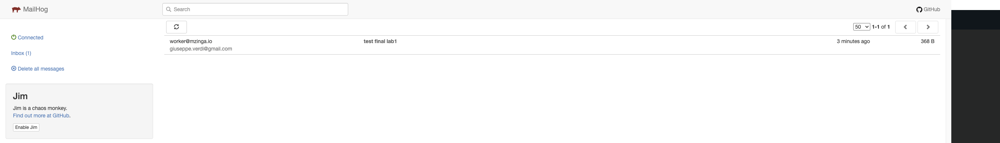

# Lab 1 Delivery Report - s348651

## Objective

Extract email sending functionality from MZinga into an external Python worker that reads directly from MongoDB, replacing the blocking synchronous email sending with an asynchronous pattern using the Strangler Fig architecture.

---

## Implementation Overview

### Architecture Pattern

The implementation follows the **Branch by Abstraction** pattern combined with **Strangler Fig**, allowing seamless transition from synchronous email sending to asynchronous processing:

- **Old behavior** (preserved for rollback): MZinga sends emails synchronously, blocking the HTTP request
- **New behavior**: MZinga marks the document as `"pending"` and returns immediately; Python worker processes asynchronously

### Key Components Modified

#### 1. MZinga: Communications Collection (`src/collections/Communications.ts`)

**Added Status Field**

I added a new field to the `fields` array in Communications collection:

```typescript
{
  name: "status",
  type: "select",
  options: [
    { label: "Pending", value: "pending" },
    { label: "Processing", value: "processing" },
    { label: "Sent", value: "sent" },
    { label: "Failed", value: "failed" },
  ],
  admin: {
    readOnly: true,
    position: "sidebar",
  },
}
```

Additionally, I added `status` to the `defaultColumns` array in the `admin` block to make it visible in the collection list view:

```typescript
admin: {
  ...collectionUtils.GeneratePreviewConfig(),
  useAsTitle: "subject",
  defaultColumns: ["subject", "tos", "status"],  // Added "status" here
  group: "Notifications",
  disableDuplicate: true,
  enableRichTextRelationship: false,
}
```

**Modified the `afterChange` Hook**

Implemented Branch by Abstraction pattern:

```typescript
if (process.env.COMMUNICATIONS_EXTERNAL_WORKER === "true") {
  // New path: mark as pending, return immediately
  if (doc.status !== "pending") {
    await payload.update({
      collection: Slugs.Communications,
      id: doc.id,
      data: { status: "pending" },
    });
  }
  return doc;
}
// Old path: email sending (preserved)
```

**Key Implementation Detail**: The check `doc.status !== "pending"` prevents infinite loops. Without it, `payload.update()` would retrigger the hook, causing recursion. With the check, the second execution sees status already set and skips the update.

**Environment Configuration**

Added `COMMUNICATIONS_EXTERNAL_WORKER=true` to `.env` to enable the new behavior.

---

#### 2. Python Worker (`lab1-worker/worker.py`)

I implemented a complete worker following the 7-step specification from the lab requirements:

**STEP 1: MongoDB Connection**
Establishes connection to MongoDB using credentials from `.env`:
```python
client = MongoClient(MONGODB_URI)
db = client["mzinga"]
communications_col = db["communications"]
users_col = db["users"]
```

**STEP 2 & 3: Poll and Claim (Atomic Operation)**
Polls for pending documents and claims them in a single atomic operation:
```python
doc = communications_col.find_one_and_update(
  {"status": "pending"},
  {"$set": {"status": "processing"}},
  return_document=True
)
```

This atomicity ensures no two worker instances process the same document simultaneously.

**STEP 4: Resolve Email Addresses**
Converts Payload relationship references to actual email addresses:
- Input: `[{ "relationTo": "users", "value": ObjectId("...") }]`
- Output: `['user@example.com']`

Queries the `users` collection to resolve each ObjectId to an email.

**STEP 5: Serialize Slate AST to HTML**
Converts the rich-text body (Slate Abstract Syntax Tree) to HTML:
- Input: `[{ "type": "paragraph", "children": [{ "text": "Hello" }] }]`
- Output: `<p>Hello</p>`

Supports:
- Block elements: paragraph, h1, h2, ul, li
- Inline elements: link, bold, italic
- Recursive processing for nested structures

**STEP 6: Send Email via SMTP**
Constructs and sends SMTP message:
```python
msg = MIMEMultipart("alternative")
msg.attach(MIMEText(html_body, "html"))
server.sendmail(EMAIL_FROM, recipients, msg.as_string())
```

Uses MailHog (fake SMTP on localhost:1025) for local testing.

**STEP 7: Update Status**
- Success → Updates document status to `"sent"`
- Exception → Updates document status to `"failed"` and logs error

---

## Testing Results

### Setup

Launched 4 terminals:
1. **Infrastructure**: `docker compose up database messagebus cache`
2. **MZinga**: `npm run dev` (port 3000)
3. **MailHog**: `docker run -d -p 1025:1025 -p 8025:8025 mailhog/mailhog`
4. **Python Worker**: `python3 worker.py` (polling every 5 seconds)

### Test Execution

**Created test Communications:**

1. Created a User with email `giuseppe.verdi@gmail.com`
2. Created multiple Communications with that user as recipient
3. Observed real-time status transitions

**MongoDB Documents (Final State)**

Note: The first two documents lack the `status` field because they were created *before* adding the status field to the schema. The last two documents show the correct state with `status: "sent"` after the worker processed them:

```javascript
{
  _id: ObjectId('69e4d3a68eeece721b65f533'),
  subject: 'Test email',
  tos: [ { relationTo: 'users', value: '69e4d2fc8eeece721b65f519' } ],
  body: [ { children: [ { text: 'this is a test example for lab1' } ] } ],
  createdAt: ISODate('2026-04-19T13:07:50.048Z'),
  updatedAt: ISODate('2026-04-19T13:07:50.048Z'),
  __v: 0
  // Note: no status field (created before schema modification)
},
{
  _id: ObjectId('69e4d8f6cbee0dac82b3eca6'),
  subject: 'new test communication',
  tos: [ { relationTo: 'users', value: '69e4d2fc8eeece721b65f519' } ],
  body: [ { children: [ { text: 'test email communication for lab1' } ] } ],
  createdAt: ISODate('2026-04-19T13:30:30.804Z'),
  updatedAt: ISODate('2026-04-19T13:30:30.804Z'),
  __v: 0
  // Note: no status field (created before schema modification)
},
{
  _id: ObjectId('69e4dd941892ce6124da1de1'),
  subject: 'test final lab1',
  tos: [ { relationTo: 'users', value: '69e4d2fc8eeece721b65f519' } ],
  body: [ { children: [ { text: 'test final lab1' } ] } ],
  createdAt: ISODate('2026-04-19T13:50:12.195Z'),
  updatedAt: ISODate('2026-04-19T13:50:12.215Z'),
  __v: 0,
  status: 'sent'  // Worker processed successfully
},
{
  _id: ObjectId('69e4e03d25cc844a08d1cc89'),
  subject: 'test communication',
  tos: [ { relationTo: 'users', value: '69e4d2fc8eeece721b65f519' } ],
  body: [ { children: [ { text: 'te' } ] } ],
  createdAt: ISODate('2026-04-19T14:01:33.822Z'),
  updatedAt: ISODate('2026-04-19T14:01:33.847Z'),
  __v: 0,
  status: 'sent'  // Worker processed successfully
}
```

**Verified Behavior:**

**Non-blocking Response**: MZinga returns immediately after saving the document
**Status Transitions**: `pending` → `processing` → `sent`
**Email Delivery**: All communications successfully sent via MailHog
**Worker Processing**: Python worker successfully polled, processed, and updated documents

**Screenshots:**

**Users Collection**


**Communications Form**


**Status Field Visible**


**Email in MailHog**


---

## Files Modified and Created

| Path | Type | Changes |
|------|------|---------|
| `mzinga/mzinga-apps/src/collections/Communications.ts` | Modified | Added `status` field; implemented Branch by Abstraction hook |
| `mzinga/mzinga-apps/.env` | Modified | Added `COMMUNICATIONS_EXTERNAL_WORKER=true` |
| `lab1-worker/worker.py` | Created | Complete 7-step worker implementation |
| `lab1-worker/requirements.txt` | Created | Dependencies: `pymongo`, `python-dotenv` |
| `lab1-worker/.env` | Created | MongoDB URI, SMTP config, polling interval |

---

## Conclusion

The key insight is that a simple feature flag (`COMMUNICATIONS_EXTERNAL_WORKER`) allows us to toggle between the old synchronous flow and the new worker-based system without redeploying everything. The trickiest part was getting the atomic `find_one_and_update` right—without it, multiple worker instances could process the same document simultaneously.

What worked well:
- MongoDB atomicity for claiming documents
- Python's flexibility for parsing Slate AST into HTML

What was more involved than expected:
- Ensuring the infinite-loop prevention logic was robust (didn't understand the bug at first)

The system now scales horizontally: more workers can be added in order to complete the job faster. Edge cases like failed emails are handled by updating status to `"failed"` so they can be reviewed or retried.
